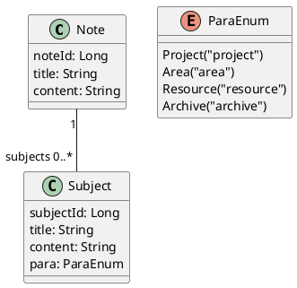

# para 분류법 구현 프로젝트

## 도메인 모델 설계

```plantuml
@startuml

class Note {
    noteId: Long
    title: String
    content: String
}

class Subject {
    subjectId: Long
    title: String
    content: String
    para: ParaEnum 
}
enum ParaEnum {
    Project("project")
    Area("area")
    Resource("resource")
    Archive("archive")
}

Note "1" -- "subjects 0..*" Subject
@enduml
```

## mockMvc : controller 테스트 ....

